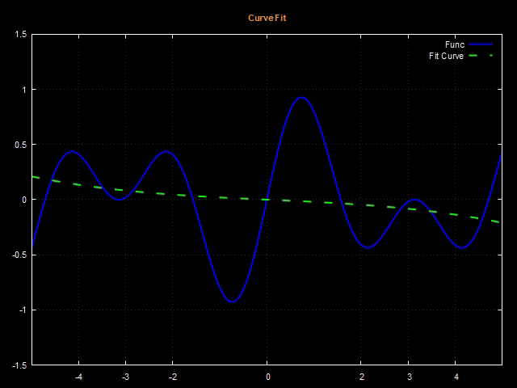

Here's the translation of the Markdown file into English:

```markdown
# Curve Fitting

Below we show the result of fitting the curve $f(x) = \sin(2x) \cos(x/2)$ in the interval $x \in [-5, 5]$. The sequence was created using degrees $n = 3, 5, 7, 9, 11, 13, \text{ and } 15$.

<p align="center">
  
</p>

In this work, we chose the **canonical basis = { $1, x, x^2, \dots, x^n$ }** of the space $\mathbb{P}_n(x)$.

Thus, we have $$f(x) \approx a_0 + a_1 x + a_2 x^2 + \dots + a_n x^n$$

The value of each coefficient is given by the system

<p align="center">

</p>

Remember that as we are fitting the function $f(x)$ in the interval $x \in [-5,5]$, the inner product will be given by the formula

<p align="center">

</p>
```