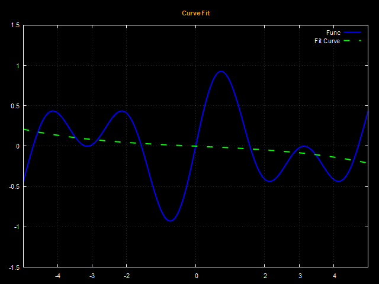
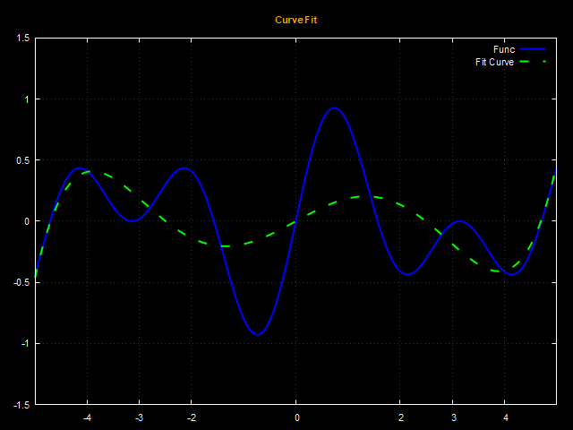
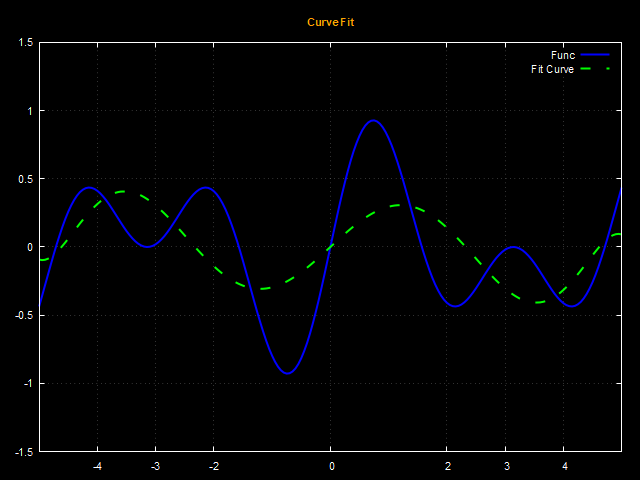
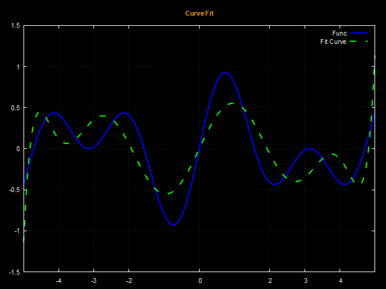
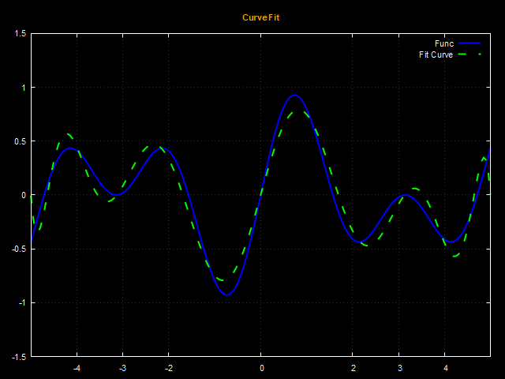
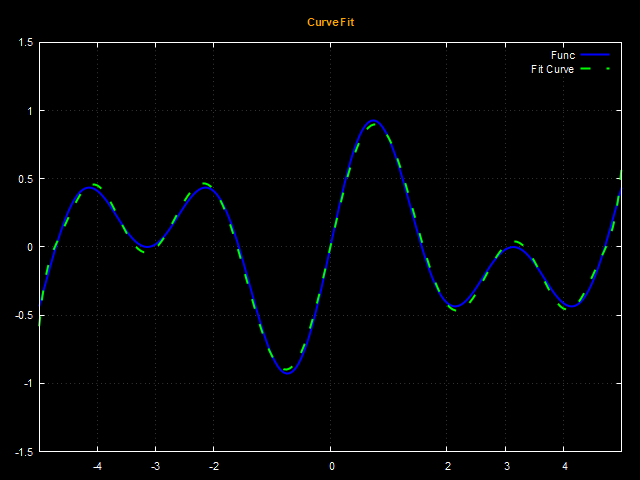
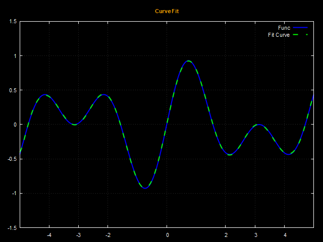

# Polynomial Curve Fitting Results

This project demonstrates curve fitting using polynomials of various degrees (3, 5, 7, ..., 15). Below are the results of the curve fitting for each polynomial degree, with the images arranged side by side for easy comparison.

## Polynomial Degree 3, 5, 7

  
  
  

## Polynomial Degree 9, 11, 13

  
  
  

## Polynomial Degree 15

  

