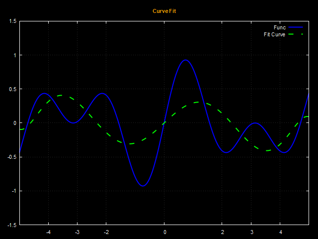

# Curve Fit to a Function

This project demonstrates a curve fitting approach using an 8th-degree polynomial approximation. The goal is to approximate a given function by fitting a polynomial to the data points generated by the function.

## Polynomial Approximation

An 8th-degree polynomial was used to approximate the function. The polynomial was generated using a least squares fitting method, which minimizes the difference between the actual data points and the fitted polynomial.

## Result

The following image shows the result of the 8th-degree polynomial approximation:

<div align="center">
    
</div>

## Getting Started

To run this project, follow these steps:

1. Clone the repository:
    ```bash
    git clone git@github.com:sj-silva/curve-fit.git
    ```

2. Compile and run the code:
    ```bash
    # Compilation command
    g++ main.cpp -o curve_fit

    # Running the code
    ./curve_fit
    ```

3. The result will be generated as `result8.png` and will be displayed in the project directory.

## Dependencies

- C++ compiler (e.g., g++)
- [gnuplot](http://www.gnuplot.info/) (for generating plots)

## License

This project is licensed under the MIT License - see the [LICENSE](LICENSE) file for details.

